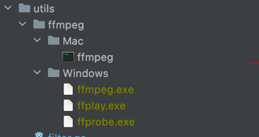
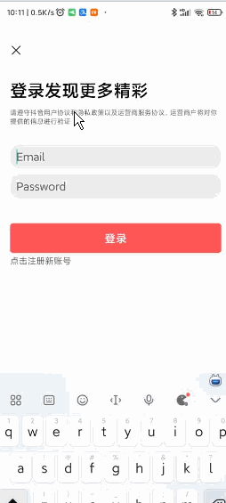
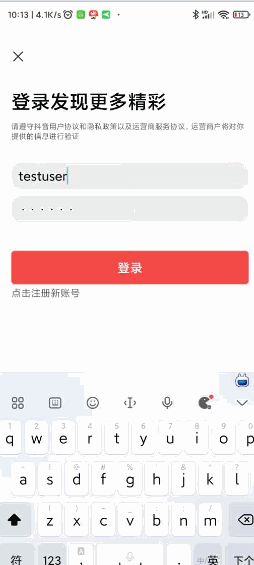
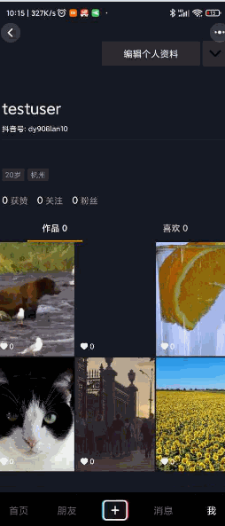

# TikTok(easy version)

队伍：java，python，go，总得会一样吧

### 工程依赖：
mysql，redis，ffmpeg，运行前确保开启mysql，redis服务，并更改constdef/config.go下的参数配置。

对于MacOs，无需安装ffmpeg，其可执行文件已经放在util/ffmpeg/Mac目录下

对于Windows，请安装ffmpeg并设置环境变量，或将ffmpeg可执行文件放于util/ffmpeg/Windows目录下，如下图：



### 编译运行：
```shell
go build && ./TikTok
```

### 技术栈
1. Web框架：Gin
2. orm框架：Gorm
3. Redis框架：redis-go
4. token鉴定：jwt
5. mysql
6. ffmpeg
7. 数据结构：TrieTree

### 项目展示
Feed:


注册：



登录：



发布视频：



点赞视频：


评论（敏感词过滤）：


### 部分技术介绍
1. 通过redis维护feed流请求的视频队列，设置队列大小，先进先出，以满足按时间顺序获得最新发布的视频，此外对于点赞数量信息维护，考虑到该数据对用户体验影响不大，所以使用redis维护一个expire_key，采用惰性过期策略，每次feed请求过来，如果监测到过期，则从数据库中拉取最新的视频列表，否则直接使用redis中的视频列表；
2. 登录功能的token实现，采用jwt对token进行分析鉴定，同时使用redis设置时效，如果过期则需要重新登录；
3. 封面获取，通过exec.Command()启用新线程调用ffmpeg获取封面，如果未截取到封面，则会使用public/image/default.png 作为视频的封面
4. 敏感词过滤：通过预先定义好的敏感词列表构建字典树，在获得评论后，会使用该字典树进行字符串匹配，并将检测到的敏感词替换为"*"